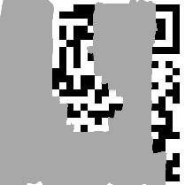
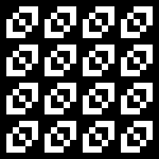
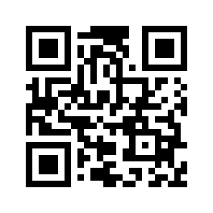

# CISCN: misc
## **【原理】**

 二维码还原

## **【工具】**

python, perl

## **【步骤】**

二维码数据为`FL4G: FLAG A4D2FFF+-`

最终flag为`flag{A4D2FFF+-}`

我们得到一个缺失了部分像素点的二维码



很明显这个二维码是不可能用正常的工具解开的。所以我们需要手工重构和解码。

这个链接 [QR Code Tutorial](http://www.thonky.com/qr-code-tutorial/) 是一个很详细的二维码解析的教程。列出了生成二维码的几步：

1. 确定编码模式
2. 对数据编码
3. 生成纠错码
4. 可能需要交错区块
5. 将数据和纠错码放进矩阵中
6. 采用缺失率最低的掩码图案
7. 添加格式和版本信息

逆着这些步骤就可以还原出二维码。

### 格式和版本信息

首先根据二维码尺寸(25x25)得出它的版本号是2.


格式信息被编码了两次，一个在左上，另一个被分割在左下和右上。格式信息一共15位，从左上对应的位置可以得到部分格式信息：

```
??????011011010
```

查表 [Format and Version String Tables](http://www.thonky.com/qr-code-tutorial/format-version-tables) 得到完整的格式信息为`010111011011010`，对应ECC等级Q，掩码图案为6.

### Data Masking

[QR Mask Patterns Explained](http://www.thonky.com/qr-code-tutorial/mask-patterns/)



`( ((row * column) mod 2) + ((row * column) mod 3) ) mod 2 == 0`

### Module Placement in Matrix

The bits of the message are placed into the QR code matrix in a very particular order. Starting from the bottom right,
bits are packed into two columns at a time, moving in a snake-like pattern up and down:

> 

The bits are packed as 8-bit units. This diagram shows where those unit boundaries are in a version 2 code:

> 

We overlay this guide on top of our QR code:

> 

and start reading off the bits.

There's a lot of missing bits there. Maybe error correction can help?

### Structure Final Message

Because this is a version 2 code, there's only one block of data and error bits. Therefore,
no structuring is required: the error bits immediately follow the data bits.

There's a total of 22 data bytes and 22 error bytes, since we're using a "Q"-level code.

### Error Correction Coding

This is where it gets interesting. QR codes use Reed-Solomon error correction coding at the
byte level. At the Q level, it can recover from 25% of the bytes being corrupt. Unfortunately,
we have only 16 intact bytes, or over 63% of the bytes missing. So maybe this isn't doable after all...

...until you look carefully at Reed-Solomon's error correcting capabilities and realize that
it can correct up to *twice* as many *erasures* - that is, if it *knows* where the errors
are, the error correction capabilities are much stronger. That means our code can recover from
up to 50% of the bytes being missing! But that means we can only correct up to 22 missing bytes;
we're missing 28. Maybe we can obtain some missing bytes based on the data encoding?

Let's set aside error correction coding for now and look at the data format.

### Data Encoding

Our message starts with the bits 0010, which according to [this table](http://www.thonky.com/qr-code-tutorial/data-encoding) 
means the code is in the *alphanumeric mode*. Since it's a version 2 QR code, the next 9 bits
are the length. Those bits are 000010100, which means that there are 20 characters.

In the alphanumeric mode, every *pair* of characters is packed into an 11-bit chunk. Thus, there are
a total of 110 bits for the payload.

Here are the data bits we have, broken down:

可以解出前七位：`FL4G: F`

What a troll - the visible bits just say "FL4G: F". Well, guess we're definitely going to have to recover the
flag itself from error correction.

Format Q gives us 22 bytes, or 176 bits of data. We only use 4+9+110 = 123 bits, so the rest of the data
segment has to be *padded*. The QR code spec says that we add up to 4 zero bits of "terminator", then zero bits
up to a byte boundary, then add *pad bytes* up to the data limit. The pad bytes just alternate between
11101100 and 00010001.

Woohoo! By adding the pad bytes that we already know (from the data encoding format), we have successfully
recovered 6 bytes, bringing the total number of missing bytes down to 22. Now we can apply error correction!

### Error Correction, again

Happily, someone has already written a [QR-compatible Reed-Solomon library for Python](https://github.com/tomerfiliba/reedsolomon),
so I don't have to figure out all the nitty-gritty math involved.

We use `reedsolo.rs_correct_msg` to correct the message with the erasure positions set (see `rs_recover.py`) and recover the message:

```python
import sys
import reedsolo

reedsolo.init_tables(0x11d,2,8)

qr_bytes = '''
'''.split()

b = bytearray()
erasures = []
for i, bits in enumerate(qr_bytes):
    if '?' in bits:
        erasures.append(i)
        b.append(0)
    else:
        b.append(int(bits, 2))

mes, ecc = reedsolo.rs_correct_msg(b, 22, erase_pos=erasures)
for c in mes:
    print '{:08b}'.format(c)
```

Split that up and decode:

```ruby
#!/usr/bin/ruby

data = ''
alphanumeric = '0123456789ABCDEFGHIJKLMNOPQRSTUVWXYZ $%*+-./:'.chars
 
def read(str, size)
	str.slice!(0, size)
end
 
def kanji(num)
	if num >= 0x1740
		(0xC140 + num / 0xC0 * 0x100 + num % 0xC0)
			.chr(Encoding::Shift_JIS).encode(Encoding::UTF_8)
	else
		(0x8140 + num / 0xC0 * 0x100 + num % 0xC0)
			.chr(Encoding::Shift_JIS).encode(Encoding::UTF_8)
	end
end
 
loop do
	case mode = read(data, 4)
	when '0010' # Alphanumeric
		count = read(data, 9).to_i(2)
		(count / 2).times do
			chunk = read(data, 11).to_i(2)
			print alphanumeric[chunk / 45]+ alphanumeric[chunk % 45]end
		print alphanumeric[read(data, 11).to_i(2)] if count.odd?
	when '0100' # Byte
		count = read(data, 8).to_i(2)
		count.times do
			print read(data, 8).to_i(2).chr
		end
	when '1000' # Kanji
		count = read(data, 8).to_i(2)
		count.times do
			print kanji(read(data, 13).to_i(2))
		end
	when '0000' # Terminate
		break
	else
		fail "Unhandled mode #{mode}"
	end
end
```

And so the data is `FL4G: FLAG A4D2FFF+-`! It might seem random and meaningless, but trust me, it's the right flag :)

Here's the full QR code, if you're curious:



This was obtained by encoding the message using [this online encoder](www.thonky.com/qrcode/); because of the stringency of the QR code spec, the output uses the same settings as the original code did, and so the same QR code is obtained.

